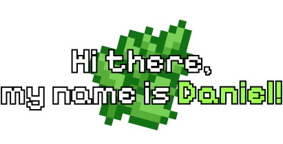

> **Software is like sex: it's better when it's free**

>Full-Stack Developer, Robotics Engineer, Software Engineer, UI Designer, Open-Source Enjoyeer and also just a chill guy

  Vintage and Retro style fan
 
 LL programming languages lover
 
 Working with C/C#/C++, Python, JS/TS, HTML/CSS
 

>While developing various projects and learning in parallel, I acquired skills that are essential for creating any full-fledged application
  

           
  

---

###  Contacts & Quick links

  Telegram: [@freakdaniel](https://t.me/freakdaniel) 
 Telegram Group: [@freakgroup](https://t.me/freakgroup)
  Instagram: [@_freakdaniel](https://instagram.com/_freakdaniel) 

 https://dontasktoask.com/ 

